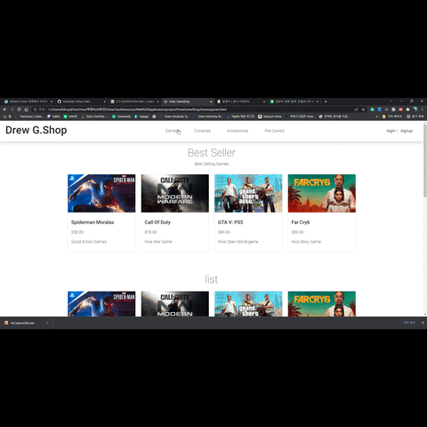

# Web Project

## About This Project
* It is a website where people can purchase various products related to games.
* I implemented the game shop website, and users and game data were through PHP, 
  and the overall framework was HTML and JavaScript, and JSON for animation effects.
* Project written by HTML, JSON, PHP, JS. 
- - -
- Index Page
 - Show the Best Selling Game 
 - Menu

   

* Exmaple code
```
<section class="" style="">
    <div class="container py-5">
      <div class="row text-center py-3">
        <div class="col-lg-6 m-auto">
          <h1 class="h1">New Arrival</h1>
          <p> NEW GAMES </p>
        </div>
      </div>
```   
- - -
* Game Page
  * Show the Games 
  
     
   
* Example Code   
   ```
    <div class="row">
        <div class="col-12 col-md-3 mb-4 h-75">
          <div class="card h-100">
            <a href="shop-single-spider.html">
              
            </a>
            <div class="card-body">
              <ul class="list-unstyled d-flex justify-content-between">
                <li>
                </li>
              </ul>
              ```   
  - - -
* Console Page
  * Show the Consoles
  
  
  
  - - -
* Used asset and style sheet
```
<link rel="stylesheet" href="https://static.pingendo.com/bootstrap/bootstrap-4.3.1.css">
  <link href="https://fonts.googleapis.com/css2?family=Nanum+Gothic:wght@700&amp;display=swap" rel="stylesheet"> 
  <link rel="stylesheet" href="assets/css/bootstrap.min.css">
  <link rel="stylesheet" href="assets/css/templatemo.css">
  <link rel="stylesheet" href="assets/css/custom.css">
  <!-- Load fonts style after rendering the layout styles -->
  <link rel="stylesheet" href="https://fonts.googleapis.com/css2?family=Roboto:wght@100;200;300;400;500;700;900&amp;display=swap">
  <link rel="stylesheet" href="assets/css/fontawesome.min.css">
```

- - -

  ## Thank You
